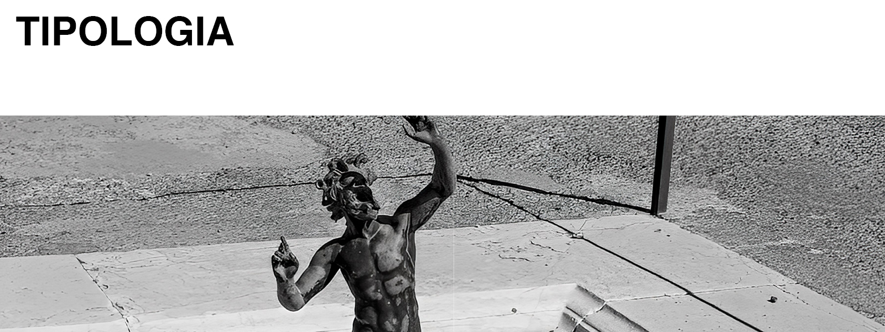

---

title: "Domus Romana"
date: 2024-05-05 00:00:00 +0000
categories: [Design, Architecture]
tags: [design]

---

#### *Domus Romana*

#### Description

College project. Create a new typology of roman *domus* based on historical constraints. The project required to create a portfolio, which should include design process, historical context, and model photographs. 

#### Historical context

Analyze real roman domestic architecture.
{: height="600" }
 _Casa del Fauno_

#### Design process

Ideation and concept execution. 

_First iteration_

_Final iteration_

#### Model making 
Create cardboard model based on final iteration. 

_Aerial view_

_Digital model montage_

#### Portfolio design & layout

Desing portfolio layout and print.

{: height="600" }
_Cover page_

{: height="600" }
_Index_

_Page spread_