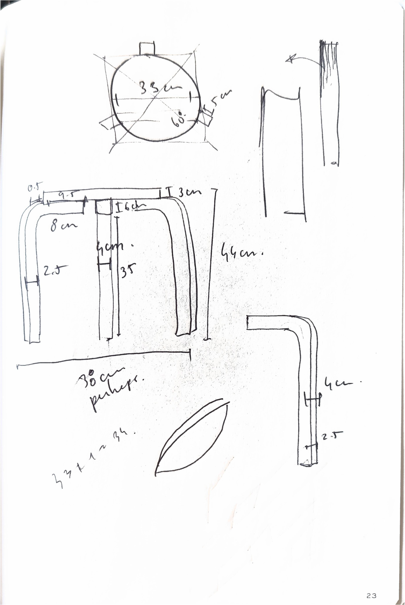
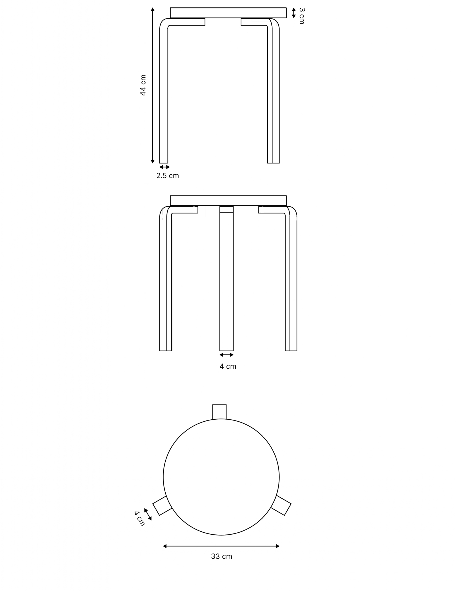

---

title: "Stool 60 - A recreation"
date: 2024-07-27 00:00:00 +0000
categories: [Design, Architecture, Woodworking]
tags: [design]

---

#### Description

Home project. A bench based on Alvar Aalto's stool 60. Made with pine wood.

#### Design process

Ideation and concept execution.

*First iteration*

#### Render

Model and dimensions (Illustrator)

*Stool dimensions*

#### Construction

TBA
